# Shop Assist — Domain ERD

Generated from risk register requirements (D-01, D-02, S-10, B-01, S-05, S-06, S-09, L-05, L-06, S-11).

---

## Entity Relationship Diagram

```mermaid
erDiagram
    %% ===================== CUSTOMER DOMAIN =====================
    CUSTOMER ||--o{ CUSTOMER_PHONE : "has"
    CUSTOMER ||--o{ CUSTOMER_ADDRESS : "has"
    CUSTOMER ||--o{ CUSTOMER_SESSION : "has"
    CUSTOMER ||--o{ PARENT_ORDER : "places"
    
    CUSTOMER {
        uuid id PK "internal stable ID (D-01)"
        string preferred_language "hi/mr/en - feeds L-03"
        jsonb metadata "preferences, flags"
        timestamp created_at
        timestamp updated_at
    }
    
    CUSTOMER_PHONE {
        uuid id PK
        uuid customer_id FK
        string phone_number "E.164 format +91XXXXXXXXXX"
        enum provenance "order_capture | otp_signup | merchant_correction | manual"
        enum consent_scope "order_only | marketing_allowed"
        boolean is_verified
        boolean is_primary
        float confidence "0.0-1.0 (D-01)"
        string source_call_id "FK to CallSession for traceability"
        timestamp verified_at
        timestamp created_at
    }
    
    CUSTOMER_ADDRESS {
        uuid id PK
        uuid customer_id FK
        string label "home | work | other"
        string line1
        string line2
        string area
        string pincode
        float latitude
        float longitude
        boolean is_default
        jsonb metadata "landmark, floor, etc."
        timestamp created_at
    }
    
    CUSTOMER_SESSION {
        uuid id PK
        uuid customer_id FK
        string session_token "opaque, for Redis lookup (T-07)"
        enum status "active | expired | revoked"
        timestamp expires_at
        timestamp created_at
    }
    
    %% ===================== MERCHANT DOMAIN =====================
    MERCHANT ||--o{ MERCHANT_CATALOG : "has"
    MERCHANT ||--o{ MERCHANT_AI_CONFIG : "has"
    MERCHANT ||--o{ MERCHANT_HOURS : "has"
    MERCHANT ||--o{ SUB_ORDER : "receives"
    
    MERCHANT {
        uuid id PK
        string name "Devanagari + Latin"
        string category_id FK "FK to CategoryTable"
        string phone_number "E.164, for fallback calls"
        string whatsapp_number "for notifications"
        string address
        string area
        string pincode
        float latitude
        float longitude
        enum status "onboarding | active | paused | churned"
        jsonb metadata "photos, notes"
        timestamp created_at
        timestamp updated_at
    }
    
    MERCHANT_HOURS {
        uuid id PK
        uuid merchant_id FK
        int day_of_week "0=Sun..6=Sat"
        time open_time
        time close_time
        boolean is_closed
    }
    
    MERCHANT_AI_CONFIG {
        uuid id PK
        uuid merchant_id FK
        string livekit_url
        string agent_identity "merchant_ai_{merchant_id}"
        string api_key_ref "secret ref, not stored"
        enum handoff_mode "api_bridge | room_transfer"
        jsonb capabilities "{confirm_only: true, substitute: false, edit_qty: false}"
        boolean human_escalation_enabled
        timestamp updated_at
    }
    
    %% ===================== CATALOG DOMAIN =====================
    GLOBAL_CANONICAL_ITEM ||--o{ ALIAS_TABLE : "has aliases"
    CATEGORY_TABLE ||--o{ GLOBAL_CANONICAL_ITEM : "categorizes"
    MERCHANT_CATALOG ||--o{ CATALOG_ITEM : "contains"
    GLOBAL_CANONICAL_ITEM ||--o{ CATALOG_ITEM : "canonicalizes"
    
    CATEGORY_TABLE {
        uuid id PK
        string name "Kirana, Dairy, Medical, etc."
        string name_devanagari "किराना, डेयरी, मेडिकल"
        uuid parent_id FK "self-ref for hierarchy"
        int display_order
        boolean is_active
    }
    
    GLOBAL_CANONICAL_ITEM {
        uuid id PK
        uuid category_id FK
        string canonical_name "Aashirvaad Atta 1kg"
        string default_unit "kg | packet | piece"
        jsonb default_aliases "['atta', 'aata', 'gehun ka atta']"
        boolean is_active
        timestamp created_at
    }
    
    ALIAS_TABLE {
        uuid id PK
        uuid canonical_item_id FK
        string token "atta, aata, doodh, dudh"
        string language "hi | mr | en | hinglish"
        uuid brand_id FK "nullable"
        boolean brand_is_specific
        string added_by "ops | merchant_correction | ocr"
        boolean verified
        timestamp created_at
    }
    
    MERCHANT_CATALOG {
        uuid id PK
        uuid merchant_id FK
        int version "snapshot version for AI"
        enum source "ocr_whatsapp | manual | festival_upload"
        jsonb ocr_confidence_summary
        timestamp created_at
        timestamp activated_at "when merchant confirmed"
    }
    
    CATALOG_ITEM {
        uuid id PK
        uuid catalog_id FK
        uuid canonical_item_id FK "nullable for local-only items"
        string local_name "merchant's name for item"
        jsonb local_aliases "['atta', 'wheat flour']"
        decimal price "merchant's price"
        string unit "kg, packet, pouch, piece"
        decimal qty_per_unit "1.0 for 1kg, 0.5 for 500g packet"
        boolean brand_is_specific
        string brand "if specific"
        float confidence "OCR/merchant verified"
        boolean is_active
        timestamp updated_at
    }
    
    %% ===================== ORDER DOMAIN =====================
    PARENT_ORDER ||--o{ SUB_ORDER : "contains"
    SUB_ORDER ||--o{ ORDER_ITEM : "has"
    SUB_ORDER ||--o{ ORDER_STATE_TRANSITION : "audit trail"
    SUB_ORDER ||--o{ NOTIFICATION_OUTBOX : "triggers"
    
    PARENT_ORDER {
        uuid id PK
        uuid customer_id FK
        enum status "placing | captured | pending | confirmed | modified | rejected | unreachable | partial"
        string customer_language "at time of order"
        jsonb customer_context "{preferred_language, address_id}"
        timestamp created_at "server time - drives all timers"
        timestamp updated_at
    }
    
    SUB_ORDER {
        uuid id PK
        uuid parent_order_id FK
        uuid merchant_id FK
        enum state "placing | captured | pending | confirmed | modified | rejected | unreachable"
        string merchant_name_denorm "for display without join"
        string merchant_phone_denorm
        jsonb items_snapshot "captured at handoff for audit"
        decimal price "only set at confirmed/modified"
        int eta_minutes "only set at confirmed/modified"
        jsonb changes_diff "[{field, from, to}] for modified"
        string rejection_reason
        uuid handoff_id "correlation ID for AI-to-AI"
        timestamp state_entered_at "for elapsed timers"
        timestamp confirmed_at
        timestamp created_at
        timestamp updated_at
    }
    
    ORDER_ITEM {
        uuid id PK
        uuid sub_order_id FK
        uuid catalog_item_id FK "nullable if unmatched"
        string item_name "as captured by customer AI"
        string item_name_normalized "after alias resolution"
        string qty_raw "paav, sawa, 2 kg - verbatim (L-05)"
        decimal qty_normalized "0.25, 1.25, 2.0"
        string unit "kg, packet, piece"
        float confidence "customer AI confidence"
        boolean changed_by_merchant_ai
        jsonb merchant_ai_edit "{from_qty, to_qty, from_price, to_price, substituted_from}"
        int display_order
    }
    
    ORDER_STATE_TRANSITION {
        uuid id PK
        uuid sub_order_id FK
        enum from_state
        enum to_state
        string triggered_by "customer_ai | merchant_ai | escalation | human | system"
        jsonb payload "context at transition"
        timestamp created_at
    }
    
    %% ===================== NOTIFICATION DOMAIN =====================
    NOTIFICATION_OUTBOX {
        uuid id PK
        uuid sub_order_id FK
        enum channel "in_app | web_push | sms | whatsapp | voice_call"
        enum status "pending | sent | delivered | failed | dead_letter"
        string idempotency_key "unique per (sub_order, channel, event)"
        jsonb payload "rendered message, localized"
        int retry_count
        timestamp next_retry_at
        timestamp sent_at
        timestamp created_at
    }
    
    %% ===================== CALL / SESSION DOMAIN =====================
    CALL_SESSION ||--o{ CALL_TURN : "has"
    CALL_SESSION ||--o{ CALL_TRANSCRIPT : "produces"
    
    CALL_SESSION {
        uuid id PK
        uuid customer_id FK "nullable until identified"
        uuid parent_order_id FK "created at placing start"
        uuid livekit_room_name
        string livekit_room_sid
        enum transport "webrtc | pstn_fallback"
        enum phase "customer_ai | merchant_ai | ended"
        enum status "connecting | active | ended | failed"
        string customer_phone_raw "as received (T-02)"
        string customer_phone_resolved "after identity resolution"
        int identity_tier "1=sip_header, 2=merchant_card, 3=dtmf, 4=none"
        jsonb turn_latency_p95 "{asr, llm, tts, network}"
        timestamp started_at
        timestamp ended_at
    }
    
    CALL_TURN {
        uuid id PK
        uuid call_session_id FK
        int turn_number
        enum speaker "customer | customer_ai | merchant_ai"
        string transcript
        string language_detected
        jsonb asr_result "{text, confidence, tokens[]}"
        jsonb llm_result "{tool_calls[], intent}"
        jsonb tts_result "{text, voice}"
        int latency_ms_asr
        int latency_ms_llm
        int latency_ms_tts
        timestamp created_at
    }
    
    CALL_TRANSCRIPT {
        uuid id PK
        uuid call_session_id FK
        string full_transcript "JSON or text"
        jsonb extracted_order "at capture complete"
        jsonb merchant_corrected_order "at confirmation"
        string audio_storage_path "S3/GCS path (S-11, S-12)"
        timestamp created_at
    }
```



---

## Risk-to-Schema Mapping

| Risk | ERD Decision |
|------|--------------|
| **D-01** | `CUSTOMER.id` = stable UUID; phones in `CUSTOMER_PHONE` with provenance |
| **D-02** | `CUSTOMER_PHONE.provenance` + `consent_scope` per number |
| **D-04** | Multiple customers can share phone (unique on `(customer_id, phone_number)`) |
| **S-10** | `PARENT_ORDER` → `SUB_ORDER` (1:N) designed from day 1; MVP uses 1:1 |
| **B-01** | `SUB_ORDER.state` = 7-state machine; `price` ONLY on `confirmed`/`modified` |
| **S-05** | `NOTIFICATION_OUTBOX` with `idempotency_key` + transactional outbox |
| **S-06** | `NOTIFICATION_OUTBOX.retry_count` + `next_retry_at` drives escalation |
| **S-09** | `CALL_SESSION` + Redis `session:{id}` for mid-call resume |
| **L-05** | `ORDER_ITEM.qty_raw` (verbatim) + `qty_normalized` (deterministic table) |
| **L-06** | `ORDER_ITEM.confidence` + `changed_by_merchant_ai` for amber highlighting |
| **S-11** | `CALL_TURN` per-component latency; `CALL_TRANSCRIPT` with audio path |

---

## Critical Indexes

```sql
-- Customer identity resolution (T-02)
CREATE INDEX idx_customer_phone_number ON customer_phone(phone_number);
CREATE INDEX idx_customer_phone_customer ON customer_phone(customer_id);

-- Order lookups (polling, history)
CREATE INDEX idx_parent_order_customer ON parent_order(customer_id, created_at DESC);
CREATE INDEX idx_sub_order_parent ON sub_order(parent_order_id);
CREATE INDEX idx_sub_order_merchant_state ON sub_order(merchant_id, state) 
    WHERE state IN ('placing','captured','pending');

-- Notification outbox processing (S-05)
CREATE INDEX idx_notification_outbox_pending ON notification_outbox(status, next_retry_at)
    WHERE status IN ('pending','failed');

-- Catalog for merchant AI (fast lookup)
CREATE INDEX idx_catalog_item_merchant ON catalog_item(catalog_id, is_active);
CREATE INDEX idx_catalog_item_canonical ON catalog_item(canonical_item_id);

-- Alias resolution (D-07, D-08)
CREATE INDEX idx_alias_token_lang ON alias_table(token, language);
```

---

## Redis Key Schema (S-09)

```
# Mid-call session state (TTL 5 min)
session:{call_session_id} = {
  "partial_order": [...items...],
  "turn_count": 3,
  "phase": "customer_ai",
  "merchant_id": "uuid",
  "updated_at": "iso8601"
}

# Merchant config cache (TTL 1 hr, invalidated on catalog activate)
merchant_config:{merchant_id} = {
  "catalog_version": 12,
  "ai_config": {...},
  "hours": [...],
  "status": "active"
}

# Idempotency for handoff (TTL 24 hr)
handoff_ack:{handoff_id} = "acknowledged"
```

---

## Open Questions

1. **Shared household (D-04)**: Multiple customers sharing a phone — same `customer_id` or separate profiles?
2. **Catalog versioning**: Full history for audit, or just latest active?
3. **Order item pricing**: Per-item in `ORDER_ITEM` or only at `SUB_ORDER` level?
4. **MVP parent order**: Create `PARENT_ORDER` + 1 `SUB_ORDER`, or skip parent?
5. **Audio retention**: `CALL_TRANSCRIPT.audio_storage_path` — bucket structure & policy (S-12)?